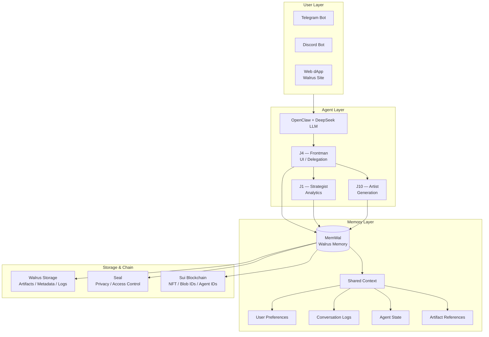

<div align="center">

# 🔴 $RIOT — Persistent Punk Agents

**Agentic NFTs with Verifiable Long-Term Memory on Sui**

[](https://sui.io/overflow)
[](https://docs.wal.app/)
[](https://docs.memwal.ai/)
[](LICENSE)

[🌐 Website](https://theriot.vercel.app) • [📊 DeepSurge](https://www.deepsurge.xyz/projects/d543ef69-81b0-47b5-a951-5441cae8f165) • [💬 Telegram](https://t.me/riotportal) • [🐦 X](https://x.com/suicryptoriot)

</div>

---

## 🧠 The Problem

AI agents today are powerful, but still fundamentally **stateless and fragmented**:

- They complete tasks in isolation and lose context across sessions
- Memory is locked to a single app, model, or device
- Agents can't share knowledge across tools, teams, or workflows
- NFTs are static JPEGs with no ongoing utility or engagement

As agents evolve from simple assistants to autonomous, long-running systems, they need a **durable foundation** — memory that is portable, persistent, and not locked into a single platform.

---

## 🔥 The Solution

**$RIOT** is a multi-agent punk collective where each character is a **long-running autonomous agent** with:

- **Persistent memory** via [MemWal](https://docs.memwal.ai/) (Walrus Memory) — cross-session, verifiable, on-chain
- **Multi-agent coordination** — agents delegate tasks and share context via Sui Stack Messaging
- **Artifact-driven workflows** — generated art, lore, and logs stored as Walrus blobs with on-chain provenance
- **Portable ownership** — sell the NFT, transfer the agent's memory history

> *"Most NFTs are dead JPEGs. What if your NFT actually remembered you?"*

---

## 🏗️ System Architecture



### Data Flow: From Chat to Chain

1. **User** sends message via Telegram Bot
2. **J4 (Frontman)** retrieves user history from **MemWal**
3. **J4 delegates** to specialist agent (e.g., J10-Artist) via **Sui Stack Messaging**
4. **Specialist agent** reads shared context, generates artifact
5. **Artifact** uploaded to **Walrus** → returns Blob ID
6. **Move smart contract** updates NFT metadata with `blob_ref`
7. **J4** responds to user with result + roast

---

## 🛠️ Tech Stack

| Layer | Technology | Purpose |
|-------|-----------|---------|
| **Blockchain** | [Sui](https://sui.io/) (Move) | NFT ownership, Agent ID registry, Blob reference |
| **Memory** | [MemWal](https://docs.memwal.ai/) | Persistent, cross-session agent memory on Walrus |
| **Storage** | [Walrus](https://docs.wal.app/) | Artifact persistence (images, logs, metadata) |
| **Privacy** | [Seal](https://seal-docs.wal.app/) | Encrypted memory segments & access control |
| **Messaging** | [Sui Stack Messaging](https://github.com/MystenLabs/sui-stack-messaging) | Inter-agent communication & recovery |
| **AI Engine** | OpenClaw + DeepSeek | Personality engine, reasoning, generation |
| **Interface** | Telegram Bot | User-facing chat interface |
| **Gallery** | Walrus Sites | Decentralized, dynamic artifact gallery |

---

## 📁 Project Structure

```
the-riot-sui/
├── contracts/
│   └── move/                    # Sui Move smart contracts
│       ├── sources/
│       │   ├── riot_nft.move    # NFT + Agent ID + Blob registry
│       │   └── riot_memory.move # On-chain memory reference
│       └── tests/
├── agents/
│   ├── j4/                      # J4 — Frontman Agent
│   ├── j1/                      # J1 — Strategist Agent
│   ├── j10/                     # J10 — Artist Agent
│   └── shared/
│       ├── memwal_adapter.py    # MemWal read/write wrapper
│       ├── walrus_client.py     # Walrus blob upload/download
│       └── stack_messaging.py   # Inter-agent messaging
├── bot/
│   └── telegram/
│       ├── main.py              # Telegram bot entrypoint
│       └── handlers/
├── frontend/
│   ├── index.html               # Landing page (this repo)
│   └── walrus-site/             # Walrus Sites deployment
├── assets/
│   └── characters/              # 18 base hand-drawn artworks
└── docs/
    ├── ARCHITECTURE.md
    └── API.md
```

---

## 🚀 Quickstart

### Prerequisites

- [Sui CLI](https://docs.sui.io/build/install)
- [Walrus CLI](https://docs.wal.app/docs/walrus-client)
- Python 3.10+
- Telegram Bot Token

### 1. Clone & Setup

```bash
git clone https://github.com/cryptoriot666/the-riot-sui.git
cd the-riot-sui

# Install dependencies
pip install -r requirements.txt

# Setup MemWal delegate key
python scripts/setup_memwal.py --agent-id J4
```

### 2. Deploy Move Contract (Testnet)

```bash
cd contracts/move
sui move build
sui client publish --gas-budget 50000000
```

### 3. Run J4 Agent Locally

```bash
cd agents/j4
python main.py \
  --memwal-key $MEMWAL_DELEGATE_KEY \
  --contract-id $RIOT_CONTRACT_ID \
  --telegram-token $TG_BOT_TOKEN
```

### 4. Upload Artifact to Walrus

```bash
walrus store assets/characters/J4_cyberpunk_v2.png
# Returns: Blob ID → update NFT metadata
```

---

## 🎬 Demo

> **Coming soon:** Full demo video for Sui Overflow 2026 submission.

### Live Preview

| Feature | Status | Link |
|---------|--------|------|
| Landing Page | ✅ Live | [theriot.vercel.app](https://theriot.vercel.app) |
| DeepSurge Project | ✅ Live | [View Project](https://www.deepsurge.xyz/projects/d543ef69-81b0-47b5-a951-5441cae8f165) |
| Telegram Bot | 🚧 WIP | [Join Portal](https://t.me/riotportal) |
| Move Contract | 🚧 WIP | `contracts/move/` |
| MemWal Integration | 🚧 WIP | `agents/shared/memwal_adapter.py` |

---

## 🧪 What Makes This Different

### For Users
- Your agent **remembers** your jokes, preferences, and history — across sessions, browsers, and devices
- Agents **coordinate** — tell J4 something, J10 knows it instantly
- Your NFT **evolves** — new artifacts, new lore, new personality over time

### For Developers
- **Open-source template** for attaching MemWal to any Sui NFT
- **Reusable adapters** for Walrus storage + Move blob registry
- **Multi-agent framework** using Sui Stack Messaging for coordination

---

## 👥 Team

| Role | Handle | Status |
|------|--------|--------|
| Founder & Artist | [@suicryptoriot](https://x.com/suicryptoriot) | ✅ Active |
| Move Developer | — | 🔍 Open |
| AI / Backend Dev | — | 🔍 Open |

**Want to join?** DM on [X](https://x.com/suicryptoriot) or join [Telegram](https://t.me/riotportal).

---

## 📜 License

MIT — Open source forever. Fork it, break it, make it yours.

---

<div align="center">

**Built for Sui Overflow 2026 — Walrus Track**

🔴 The riot is inevitable. 🔴

</div>
                   # J10 — Artist Agent
│   └── shared/
│       ├── memwal_adapter.py    # MemWal read/write wrapper
│       ├── walrus_client.py     # Walrus blob upload/download
│       └── stack_messaging.py   # Inter-agent messaging
├── bot/
│   └── telegram/
│       ├── main.py              # Telegram bot entrypoint
│       └── handlers/
├── frontend/
│   ├── index.html               # Landing page (this repo)
│   └── walrus-site/             # Walrus Sites deployment
├── assets/
│   └── characters/              # 18 base hand-drawn artworks
└── docs/
    ├── ARCHITECTURE.md
    └── API.md
```

---

## 🚀 Quickstart

### Prerequisites

- [Sui CLI](https://docs.sui.io/build/install)
- [Walrus CLI](https://docs.wal.app/docs/walrus-client)
- Python 3.10+
- Telegram Bot Token

### 1. Clone & Setup

```bash
git clone https://github.com/cryptoriot666/the-riot-sui.git
cd the-riot-sui

# Install dependencies
pip install -r requirements.txt

# Setup MemWal delegate key
python scripts/setup_memwal.py --agent-id J4
```

### 2. Deploy Move Contract (Testnet)

```bash
cd contracts/move
sui move build
sui client publish --gas-budget 50000000
```

### 3. Run J4 Agent Locally

```bash
cd agents/j4
python main.py   --memwal-key $MEMWAL_DELEGATE_KEY   --contract-id $RIOT_CONTRACT_ID   --telegram-token $TG_BOT_TOKEN
```

### 4. Upload Artifact to Walrus

```bash
walrus store assets/characters/J4_cyberpunk_v2.png
# Returns: Blob ID → update NFT metadata
```

---

## 🎬 Demo

> **Coming soon:** Full demo video for Sui Overflow 2026 submission.

### Live Preview

| Feature | Status | Link |
|---------|--------|------|
| Landing Page | ✅ Live | [theriot.vercel.app](https://theriot.vercel.app) |
| DeepSurge Project | ✅ Live | [View Project](https://www.deepsurge.xyz/projects/d543ef69-81b0-47b5-a951-5441cae8f165) |
| Telegram Bot | 🚧 WIP | [Join Portal](https://t.me/riotportal) |
| Move Contract | 🚧 WIP | `contracts/move/` |
| MemWal Integration | 🚧 WIP | `agents/shared/memwal_adapter.py` |

---

## 🧪 What Makes This Different

### For Users
- Your agent **remembers** your jokes, preferences, and history — across sessions, browsers, and devices
- Agents **coordinate** — tell J4 something, J10 knows it instantly
- Your NFT **evolves** — new artifacts, new lore, new personality over time

### For Developers
- **Open-source template** for attaching MemWal to any Sui NFT
- **Reusable adapters** for Walrus storage + Move blob registry
- **Multi-agent framework** using Sui Stack Messaging for coordination

---

## 👥 Team

| Role | Handle | Status |
|------|--------|--------|
| Founder & Artist | [@suicryptoriot](https://x.com/suicryptoriot) | ✅ Active |
| Move Developer | — | 🔍 Open |
| AI / Backend Dev | — | 🔍 Open |

**Want to join?** DM on [X](https://x.com/suicryptoriot) or join [Telegram](https://t.me/riotportal).

---

## 📜 License

MIT — Open source forever. Fork it, break it, make it yours.

---

<div align="center">

**Built for Sui Overflow 2026 — Walrus Track**

🔴 The riot is inevitable. 🔴

</div>
